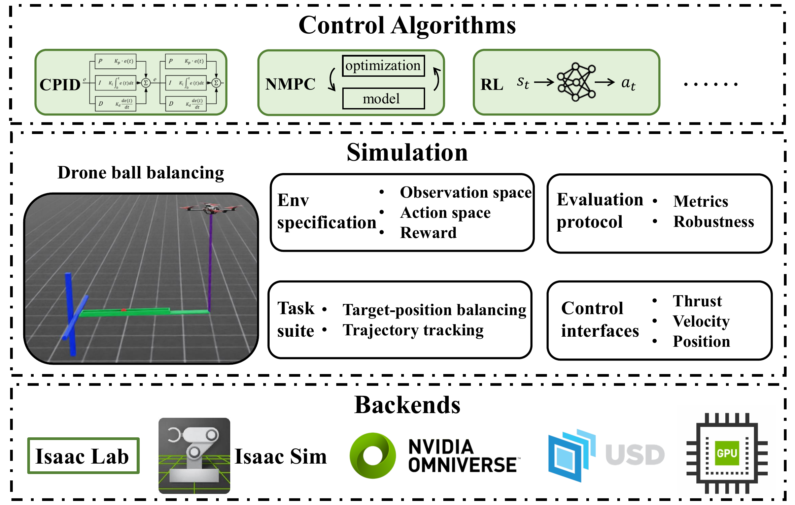
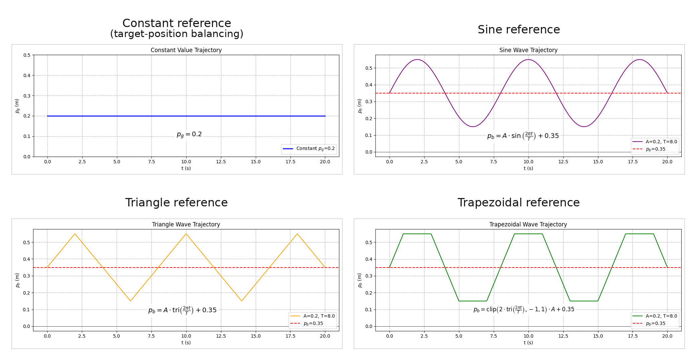

# Aerial-Balance-Bench

Official implementation of:

**Aerial-Balance-Bench: A Controlled and Reproducible Drone-Ball Balancing Benchmark for Indirect Dynamic Aerial Manipulation**

Aerial-Balance-Bench is an Isaac Lab/Sim based benchmark for studying indirect dynamic aerial manipulation. A vertically constrained tethered drone tilts a beam through a rope, and the beam motion drives a rolling ball to a target position or along a reference trajectory.

The benchmark provides:

- Two task families—target-position balancing and trajectory tracking—plus a unified reference-tracking representation for mixed-policy training
- Three high-level command interfaces: thrust, velocity, and position
- A Gym-style Isaac Lab environment with unified observations, actions, rewards, and evaluation metrics
- Robustness tests for mass variation, low-level gain variation, action delay, velocity-response dynamics, and external disturbance
- Reference baselines for cascaded PID, nonlinear feedforward--feedback control, nonlinear MPC, and model-free RL

## Contents

- [Overview](#overview)
- [Benchmark Design](#benchmark-design)
- [User Guide](#user-guide)
- [Baselines and Results](#baselines-and-results)
- [Citation](#citation)
- [License](#license)

## Overview

Most aerial manipulation benchmarks focus on direct interaction through robotic arms, grippers, or attached payloads. Aerial-Balance-Bench focuses on **indirect dynamic manipulation**: the drone does not touch the ball directly, but instead regulates the motion of an intermediate beam that moves the ball.

The physical setup contains a drone, rope, beam, and ball. One end of the beam is connected to the drone through a rope, the drone is constrained to move vertically, and the other end of the beam is fixed during nominal operation. This simplified setup isolates the core coupling between aerial actuation, beam inclination, and ball rolling dynamics while keeping the system reproducible in simulation and deployable on a real platform.

The implementation is built on Isaac Lab and exposes a Gym-style interface for controller development, RL training, and evaluation. The benchmark is designed to support controlled comparison between classical feedback control, optimization-based control, learning-based control, robustness methods, and sim-to-real transfer strategies.

<p align="center">
  
</p>

<p align="center">
  <sub>Benchmark framework overview. Source figure: <a href="docs/figures/benchmark_framework.png">benchmark_framework.png</a>.</sub>
</p>

## Benchmark Design

### Tasks

| Task | Config value | Goal | Reset/reference design |
| --- | --- | --- | --- |
| Target-position balancing | `task_name: target_position` | Drive the ball to a fixed or sampled target position on the beam. | Initial ball position and target position are sampled from configurable ranges. |
| Trajectory tracking | `task_name: trajectory_tracking` | Track a time-varying reference ball position. | Supports sine, triangle, trapezoid, random B-spline, and random ramp-dwell references. The legacy `random` selector still samples only the original three periodic families. |
| Unified reference tracking | `task_name: unified_tracking` | Train one policy on constant, sine, triangle, and trapezoid references and evaluate held-out families. | Reference type and parameters are sampled per environment; random B-spline and random ramp-dwell singleton configs test generalization without entering the supplied mixed-training distribution. |

`unified_tracking` expresses target-position balancing as a constant trajectory while keeping reference generation independent from initial-state sampling. The supplied mixed config uses random constant goals with independent random ball positions and starts dynamic references on their sampled reference position. The two random held-out families must be selected explicitly and are not sampled by the existing mixed or legacy-random configurations. See [Unified Reference Tracking](docs/unified_reference_tracking.md) for the complete sampling, reset, reward, preview, metric, and compatibility contracts.

The ball reference trajectories are visualized below. The constant reference corresponds to the target-position balancing task, while the sine, triangle, and trapezoidal references correspond to trajectory-tracking settings.

<p align="center">
  
</p>

### Control interfaces

The selected interface controls how the high-level policy acts on the drone. All interfaces use incremental actions, so the action updates the current command rather than replacing it with an absolute command.

| Interface | Config value | Action meaning | Command executed by low-level controller | Notes |
| --- | --- | --- | --- | --- |
| Thrust command | `interface_name: thrust` | `delta_Frz`, an increment of vertical thrust | SE(3) attitude controller | Most direct actuation, strongest coupling with low-level flight dynamics. |
| Velocity command | `interface_name: velocity` | `delta_vrz`, an increment of drone vertical velocity | SE(3) velocity controller | Main interface used by the reference baselines; practical separation between balancing and flight control, but delay-sensitive. |
| Position command | `interface_name: position` | `delta_drz`, an increment of drone vertical position | SE(3) position controller | Highest-level abstraction, simpler high-level command semantics, usually more lag-prone. |

The command update is:

```text
u_k = u_{k-1} + clip(a_k)
```

where `a_k` is the high-level action and the clip bound is determined by the selected interface configuration.

For the detailed derivation of the dynamic model associated with each control interface, please refer to [dynamic_model.pdf](docs/dynamic_model.pdf).

### Observation space

By default, the policy observation is the unchanged 11-D tensor returned under `observations["policy"]`:

```text
[pb, vb, ab, theta, omega, alpha, drz, vrz, arz, pg, a_prev]
```

| Field | Meaning |
| --- | --- |
| `pb` | Ball position along the beam |
| `vb` | Ball velocity along the beam |
| `ab` | Ball acceleration along the beam |
| `theta` | Beam angle |
| `omega` | Beam angular velocity |
| `alpha` | Beam angular acceleration |
| `drz` | Drone vertical displacement |
| `vrz` | Drone vertical velocity |
| `arz` | Drone vertical acceleration |
| `pg` | Desired ball position, fixed for target-position balancing and time-varying for tracking |
| `a_prev` | Previous high-level action |

All tasks share this legacy observation prefix. The index constants are available in `baselines/base_policy.py` as `ObservationIndex`.

Unified configs can enable a configurable short reference preview:

```yaml
reference_preview:
  enabled: true
  future_steps: 30
```

The legacy 11-D prefix and all of its indices remain unchanged. With a preview horizon `H`, the environment appends:

```text
[vg_0, pg_1, vg_1, ..., pg_H, vg_H]
```

The resulting raw dimension is `12 + 2H` (72 for the standard unified `H = 30` configs). The RL `reference_preview` adapter consumes plant state, previous action, and every current/future position and velocity reference. Existing `legacy8` and `full11` adapters continue to consume only the legacy prefix.

For a fixed-size, relative preview input, configure the RL policy separately:

```yaml
observation_mode: relative_reference_preview
reference_preview_samples: 10
```

Without delay compensation, this mode requires `H >= K` and `H % K == 0`. It samples offsets `H/K, 2H/K, ..., H` and produces `[pb-pg_0, vb-vg_0, ab, theta, omega, alpha, vrz, arz, a_prev, delta_pg_1:K, delta_vg_1:K]`. With `H = 30` and `K = 10`, the sampled offsets are `3, 6, ..., 30` and the policy input has 29 dimensions. Predictor-enabled evaluation retains this field layout by using raw `H=38`, base offset `D=8`, and effective horizon `H-D=30`.

An optional asymmetric adaptive RL model conditions the actor on measured and
commanded velocity histories while giving the critic the true first-order
response parameters during training:

```yaml
velocity_response_adaptation:
  enabled: true
  history_length: 30
  latent_dim: 8
  encoder:
    hidden_dims: [64, 32]
    activation: relu
```

Here `history_length` is the length of each channel. At decision time the actor
encoder receives `[vrz_(t-H:t-1), command_z_(t-H:t-1)]`, with each channel in
oldest-to-newest order, and the actor head consumes `[base_input, z]`. The
critic does not use the encoder or histories; it consumes
`[base_input, tau_s, gain, bias]`. OU-noise parameters are deliberately
excluded. With the default relative preview, the skrl transport state has 92
dimensions, the actor-visible input has 89, the actor head has 37, and the
critic has 32. Evaluation retains the 92-D transport contract with three zero
privileged placeholders that the actor strictly ignores. Reset histories are
zero padded, and post-autoreset response parameters are read from the current
environment state. This v2 contract requires the velocity interface, effective
action delay `D=0`, and an inactive state predictor.

### Rewards and termination

Target-position balancing uses a regulation reward with object terms, control effort terms, a failure penalty, and a near-goal bonus:

```text
r = r_object + r_control + r_failure + r_goal
```

Trajectory tracking uses position and velocity tracking terms, control effort, a failure penalty, and progress toward the reference:

```text
r = r_object + r_control + r_failure + r_progress
```

Unified reference tracking applies one common position/velocity tracking reward to every supported reference type, including `constant` and both held-out random families. It deliberately does not add a constant-only goal bonus, so the policy is optimized against a single objective.

For the exact reward parameters and the mapping between paper notation and code configuration fields, see the [reward design](docs/reward_design.md) document.

Episodes terminate when the episode horizon is reached, the beam angle exceeds the configured limit, the ball leaves the feasible beam range, or the task-specific error exceeds its configured failure threshold.

### Evaluation metrics

For target-position balancing, the evaluator reports:

| Metric | Meaning |
| --- | --- |
| `SR` / `success_rate` | Fraction of episodes that enter the target zone and remain there until the end |
| `SE` / `steady_state_error` | Mean absolute final-window position error |
| `CONT` / `convergence_time` | First time the ball enters the tolerance band and stays there |
| `CLIT` / `climbing_time` | First time the ball enters the tolerance band |
| `COMT` | Controller computation time, reported by policy runners |

For trajectory tracking, the evaluator reports:

| Metric | Meaning |
| --- | --- |
| `MAE` / `mean_absolute_error` | Mean absolute position tracking error |
| `RMSE` / `root_mean_square_error` | Root mean square position tracking error |
| `MAXE` / `maximum_absolute_error` | Worst position tracking error in an episode |
| `COMT` | Controller computation time, reported by policy runners |

The unified evaluator always reports global and per-type MAE/RMSE/MAXE plus completed-episode counts. For constant episodes it additionally reports the target-position success rate, steady-state error, climbing time, and convergence time under `constant_`-prefixed keys. Types with no completed episodes have count zero and numeric metrics `NaN`.

### Robustness tests

Robustness settings are configured under `robustness` in the environment YAML files.

| Test | Config fields | Purpose |
| --- | --- | --- |
| Ball-mass variation | `ball_mass_variation_enabled`, `ball_mass_range` | Tests generalization to object parameter changes. |
| Low-level gain variation | `controller_gain_variation_enabled`, `controller_gain_range` | Tests sensitivity to imperfect command tracking by the drone controller. |
| Action delay | `action_delay_enabled`, `delay_step`, `delay_step_choices` | Inserts a fixed or reset-time randomized command delay between high-level output and executed command. |
| Velocity response | `velocity_response_enabled`, target ranges, sim scalars, and noise parameters | Uses a feed-forward lead-lag command so the existing velocity loop approximates a configured final first-order response; supports no noise, Gaussian noise, or OU noise. |
| External disturbance | `external_disturbance_enabled`, OU process parameters | Applies temporally correlated vertical motion at the otherwise fixed beam endpoint. |

An empty `delay_step_choices` keeps the legacy fixed `delay_step` behavior. A
non-empty list takes precedence and samples one delay uniformly and independently
for each environment whenever that environment resets; the sampled value remains
fixed for the episode. Zero is a valid choice and makes that environment execute
the current command without delay. The existing `delay_step` diagnostic reports
the sampled value for each environment.

```yaml
robustness:
  enabled: true
  action_delay_enabled: true
  delay_step: 15              # Used only when delay_step_choices is empty.
  delay_step_choices: [0, 8, 15]
```

State predictors continue to use one fixed nominal horizon. An explicit
`state_predictor.delay_step` is therefore valid with random environment delays.
`delay_step: auto` resolves only for fixed delay or a single unique choice; with
multiple choices an enabled predictor requires an explicit nominal value.

The delay and velocity-response stages are independent. With both enabled, the
command passes through the configured delay first and then the lead-lag stage.
When `velocity_response_enabled: false`, the stage is an exact command
passthrough. When enabled, `velocity_response_tau_s_range`,
`velocity_response_gain_range`, and `velocity_response_bias_range` describe the
desired final response \(G_{real}\). The fixed scalars
`velocity_response_sim_tau_s: 0.139`, `velocity_response_sim_gain: 1.0`, and
`velocity_response_sim_bias: -0.00055` describe the existing velocity-loop
model \(G_{sim}\) that is inverted by the feed-forward command. The simulator
output limit must currently remain zero.

At each control step, the model first advances the sampled target response and
adds the configured Gaussian/OU output noise. It then computes the command that
the discrete \(G_{sim}\) model would require to realize that target on the next
step. `velocity_response_executed_z` is therefore the desired final response,
while `velocity_response_compensated_command_z` is the command sent to the
low-level controller. The implementation does not invert the controller's
intrinsic pure delay and does not limit the compensated command. Controller
gain or mass randomization can also make the fixed inverse only approximate.

## User Guide

### Installation

This repository is meant to be run inside an Isaac Sim / Isaac Lab Python environment.

Recommended one-command setup for the project-side Python dependencies:

```bash
conda env create -f conda_env.yml
conda activate aerial_balance_bench
```

The `conda_env.yml` file is a curated environment specification, not a full export of a developer machine. It includes the packages required by the core benchmark, rollout utilities, NMPC baseline, and RL/RPO baseline.

Isaac Sim and Isaac Lab are still required as platform dependencies. After creating the environment, install or register Isaac Lab for this conda environment following your Isaac Lab installation, then verify:

```bash
python -c "import torch, gymnasium, yaml; import omni.isaac.lab"
```

Required core dependencies:

- Isaac Sim 4.2.0
- Isaac Lab 1.4.0
- Python 3.10
- PyTorch
- Gymnasium
- NumPy
- PyYAML
- tqdm and Matplotlib for rollout utilities

Optional baseline dependencies:

- NMPC: `do-mpc` and `casadi`
- RL/RPO: `skrl`; `wandb` is optional for experiment logging

From the project root, expose the package parent on `PYTHONPATH` when using interactive scripts or notebooks:

```bash
export PYTHONPATH="$(pwd)/..:${PYTHONPATH}"
```

Run all commands below from the repository root:

```bash
cd /path/to/aerial_balance_bench
```

### Smoke test

Run a short zero-action rollout with the existing smoke-test config:

```bash
# target-position balancing
python3 scripts/zero_action_policy_eval.py \
  --config environments/configs/target_position_balancing.yaml \
  --episodes 10 \
  --num_envs 10 \
  --headless

# trajectory tracking
python3 scripts/zero_action_policy_eval.py \
  --config environments/configs/trajectory_tracking.yaml \
  --episodes 10 \
  --num_envs 10 \
  --headless

# unified mixed reference tracking
python3 scripts/zero_action_policy_eval.py \
  --config environments/configs/unified_tracking_mixed.yaml \
  --episodes 4 \
  --num_envs 4 \
  --headless
```

Logs are written under `logs/zero_action/` unless overridden by the YAML file or `--run_name`.

### Evaluate baselines

CPID:

```bash
python3 scripts/cpid_policy_eval.py \
  --config baselines/configs/cpid_target_position_eval_delay_free.yaml \
  --episodes 10 \
  --num_envs 10 \
  --headless
```

The unchanged CPID controller can also be evaluated through the unified task.
The default run uses the nominal mixed configuration and reports global and
per-reference-type metrics:

```bash
python3 scripts/cpid_unified_tracking_eval.py \
  --config baselines/configs/cpid_unified_tracking_eval.yaml \
  --episodes 16 \
  --num_envs 16 \
  --headless
```

For unambiguous task-level comparisons, switch to singleton environment
configs. `constant` represents target-position balancing, while the dynamic
configs evaluate trajectory tracking:

```bash
# Target-position balancing represented as a constant reference
python3 scripts/cpid_unified_tracking_eval.py \
  --config baselines/configs/cpid_unified_tracking_eval.yaml \
  --env_config environments/configs/unified_tracking_constant.yaml \
  --episodes 10 \
  --num_envs 10 \
  --run_name cpid_unified_constant_smoke \
  --headless

# Sine trajectory tracking
python3 scripts/cpid_unified_tracking_eval.py \
  --config baselines/configs/cpid_unified_tracking_eval.yaml \
  --env_config environments/configs/unified_tracking_sine.yaml \
  --episodes 10 \
  --num_envs 10 \
  --run_name cpid_unified_sine_smoke \
  --headless
```

With the state predictor disabled, CPID retains its legacy behavior of consuming
only the first 11 fields and the current reference position `pg`. With an active
state predictor, the unified runner also supplies `pg_1 ... pg_D`, so each
forward-prediction step uses the reference at the same future offset. The
preview must be enabled and satisfy `reference_preview.future_steps >=
state_predictor.delay_step`; the runner fails at startup instead of padding a
short preview. Reference velocities are not consumed.

The response-aware `D=8` example uses a separate `H=8` environment config;
the standard unified RL configs use `H=30`, while legacy full-preview policy
templates remain available for checkpoints trained with the earlier layout:

```bash
python3 scripts/cpid_unified_tracking_eval.py \
  --config baselines/configs/cpid_unified_tracking_predictor_eval.yaml \
  --episodes 2 \
  --num_envs 2 \
  --headless
```

Use the sine, triangle, trapezoid, random B-spline, and random ramp-dwell
singleton configs for publishable per-family comparisons; use the mixed config
as an aggregate transfer and sampling-coverage check.

NMPC:

```bash
python3 scripts/nmpc_policy_eval.py \
  --config baselines/configs/nmpc_target_position_eval_delay_free.yaml \
  --n_horizon 25 \
  --episodes 10 \
  --num_envs 2 \
  --headless
```

NFFB on unified reference tracking:

```bash
# Delay-free baseline
python3 scripts/nffb_policy_eval.py \
  --config baselines/configs/nffb_unified_tracking_eval.yaml \
  --env_config environments/configs/unified_tracking_mixed.yaml \
  --episodes 10 \
  --num_envs 10 \
  --run_name nffb_unified_delay_free_smoke \
  --headless

# D=8 predictor with aligned plant state and future references
python3 scripts/nffb_policy_eval.py \
  --config baselines/configs/nffb_unified_tracking_predictor_eval.yaml \
  --env_config environments/configs/unified_tracking_sine.yaml \
  --episodes 2 \
  --num_envs 2 \
  --run_name nffb_unified_predictor_sine_smoke \
  --headless
```

NFFB can additionally invert the deterministic nominal first-order response.
The inverse is disabled by default and is independent of delay prediction.
These two fixed-parameter, noise-free examples isolate the `D=0` inverse and
the combined `D=8` predictor plus inverse:

```bash
python3 scripts/nffb_policy_eval.py \
  --config baselines/configs/nffb_unified_tracking_response_compensation_eval.yaml \
  --episodes 2 --num_envs 2 --headless

python3 scripts/nffb_policy_eval.py \
  --config baselines/configs/nffb_unified_tracking_predictor_response_compensation_eval.yaml \
  --episodes 2 --num_envs 2 --headless
```

For a batch over the current delayed deterministic singletons, use:

```bash
RUN_CONFIG=baselines/configs/nffb_unified_tracking_predictor_eval.yaml \
REFERENCE_TYPES="constant sine triangle trapezoid" \
scripts/run_nffb_policy_eval_configs.sh --headless
```

Use only delay-free environment configs with the predictor-disabled run
config. NFFB requires the velocity interface, a reference preview
horizon of at least one step in delay-free mode. With an action delay of
`D > 0`, the environment and state predictor must both be enabled. Fixed-delay
environments require matching `delay_step` values; random-delay environments
use the predictor's explicitly configured fixed nominal `D`. In both cases the
preview must satisfy `H >= D + 1`. The controller
then uses the predicted plant state at `k + D`, `pg_D`, `vg_D`, and
`(vg_{D+1} - vg_D) / dt`. Its integral and command filter still advance only
once per policy call. See
[NFFB Controller](docs/nffb_controller.md) for the model, configuration,
diagnostics, and tuning workflow.

For the automated phase-zero sine search (`max_acc=5.0 m/s^2`), run:

```bash
conda run -n isaac-sim python scripts/tune_nffb_sine.py --stage all
```

The search is resumable and writes a candidate leaderboard, per-episode
tracking/frequency metrics, deterministic stress tests, feedforward ablation,
and a 500-episode acceptance report. Its search space and thresholds are in
`baselines/configs/nffb_sine_tuning.yaml`.

For a coarse search shared by the `constant`, `random_b_spline`, and
`random_ramp_dwell` families currently selected by
`environments/configs/unified_tracking_mixed.yaml`, run:

```bash
conda run -n isaac-sim python scripts/tune_nffb_mixed.py --stage all
```

The mixed workflow keeps that environment config unchanged, screens candidates
with `seed=666`, and validates the finalists with the independent single seed
`667`. The current tuning config disables NFFB velocity-response compensation;
the explicit response midpoint `tau=0.155 s`, `gain=0.86`, and `bias=-0.0035`
is retained only for response-model diagnostics and future predictor use.
Mixed candidates are ranked by safety/coverage and absolute per-family errors
rather than sine NRMSE or fitted phase/gain. Search settings and gates are in
`baselines/configs/nffb_mixed_tuning.yaml`, and resumable artifacts are written
under `logs/nffb/mixed_tuning/coarse_v1_no_comp/`.

The completed no-compensation run did not promote a policy. Its safety-ranked
candidate used `outer_omega=0.68`, `filter_omega=14`, and `k_theta=6`. It had no
termination, boundary, or non-finite failures across 192 validation episodes
and improved mean RMSE by about `8.1%` relative to the generic policy, but its
`1.61%` final-quarter saturation rate exceeded the `1%` gate. The earlier
compensation-enabled `coarse_v1` run also failed its gates. See
`docs/nffb_controller.md#no-compensation-coarse-v1-result` before treating any
generated candidate as a unified controller.

Refine that provisional point with the bounded no-compensation grid:

```bash
conda run -n isaac-sim python scripts/tune_nffb_mixed.py \
  --config baselines/configs/nffb_mixed_grid_tuning.yaml \
  --stage all
```

The completed `grid_v1_no_comp_seed668` run evaluated all 27 combinations with
500 parallel environments and 500 episodes each. Every candidate avoided
termination, boundary, non-finite, coverage, and full-run saturation failures,
but all exceeded the 1% final-quarter saturation gate. The safety-ranked best
was `outer_omega=0.55`, `k_theta=4.5`, and `integral_pole=0.10`; it achieved
`0.07191 m` mean RMSE and `1.338%` final-quarter saturation. Results and the
explicit best-observed policy are retained under
`logs/nffb/mixed_tuning/grid_v1_no_comp_seed668/`; the policy is an observed
single-seed grid winner, not a promoted baseline.

The phase-zero sine-specific policy selected by this workflow is
`baselines/configs/nffb_sine_phase0_acc5.yaml`. Evaluate it without changing
the generic NFFB defaults:

```bash
python3 scripts/nffb_policy_eval.py \
  --config baselines/configs/nffb_unified_tracking_predictor_eval.yaml \
  --env_config environments/configs/unified_tracking_sine.yaml \
  --policy_config baselines/configs/nffb_sine_phase0_acc5.yaml \
  --episodes 100 \
  --num_envs 10 \
  --run_name nffb_sine_phase0_acc5_eval \
  --headless
```

The command above exercises the tuned policy in the current delayed,
response-aware environment; it is not a replay of the delay-free tuning
result. In the original fixed `seed=666`, 500-environment delay-free
validation, this policy achieved
mean MAE/RMSE of `0.00602/0.00998 m`, versus `0.05259/0.06236 m` for the
generic defaults, with no terminations or beam-edge margin violations.
Detailed stress and acceptance results are recorded in
[NFFB Controller](docs/nffb_controller.md#phase-zero-sine-result).

RL evaluation requires a trained checkpoint:

```bash
python3 scripts/rl_policy_eval.py \
  --config baselines/configs/rl_target_position_rpo_eval_delay_free.yaml \
  --checkpoint /path/to/best_agent.pt \
  --episodes 10 \
  --num_envs 10 \
  --headless
```

Evaluate one unified preview-policy checkpoint on an individual reference family by overriding the environment config:

```bash
python3 scripts/rl_policy_eval.py \
  --config baselines/configs/rl_unified_tracking_rpo_eval.yaml \
  --env_config environments/configs/unified_tracking_sine.yaml \
  --checkpoint /path/to/best_agent.pt \
  --episodes 1000 \
  --num_envs 10 \
  --run_name rpo_unified_sine_eval \
  --headless
```

Use another `unified_tracking_<type>.yaml` singleton config for the other
families. In particular, `unified_tracking_random_b_spline.yaml` and
`unified_tracking_random_ramp_dwell.yaml` evaluate generalization beyond the
four-family training distribution. CPID and NMPC retain their existing task
paths.

Evaluate the same 29-D relative-preview checkpoint with an eight-step model
predictor and an aligned 38-step raw preview:

```bash
python3 scripts/rl_policy_eval.py \
  --config baselines/configs/rl_unified_tracking_rpo_predictor_eval.yaml \
  --env_config environments/configs/unified_tracking_sine_delay_d8_h38.yaml \
  --checkpoint /path/to/best_agent.pt \
  --episodes 1000 \
  --num_envs 10 \
  --run_name rpo_unified_sine_predictor_d8_eval \
  --headless
```

The six `unified_tracking_<type>_delay_d8_h38.yaml` configs isolate action
delay: response dynamics, parameter randomization, and additive response noise
are disabled. For deterministic response-aware evaluation, enable the response
in a separate fixed-parameter/noise-free environment config and set explicit
nominal predictor `velocity_response_tau_s`, `gain`, and `bias` values through
`policy_overrides`; do not resolve `auto` from randomized parameter ranges.

### Train an RL policy using RPO

```bash
python3 scripts/rl_train.py \
  --config baselines/configs/rl_target_position_rpo_train.yaml \
  --num_envs 1024 \
  --max_iterations 300 \
  --headless
```

The default RPO training configuration uses the velocity interface and the `legacy8` observation adapter.

Train one RPO policy on the mixed distribution with a 30-step preview sampled at 10 uniformly spaced future offsets:

```bash
python3 scripts/rl_train.py \
  --config baselines/configs/rl_unified_tracking_rpo_train.yaml \
  --num_envs 1024 \
  --max_iterations 300 \
  --headless
```

Train the asymmetric adaptive variant on the same randomized velocity
response distribution:

```bash
python3 scripts/rl_train.py \
  --config baselines/configs/rl_unified_tracking_rpo_adaptive_train.yaml \
  --num_envs 1024 \
  --max_iterations 300 \
  --headless
```

Adaptive runs retain complete `agent_*.pt` checkpoints and additionally write
`adaptive_actor_critic_heads_*.pt` and
`velocity_response_encoder_*.pt`. Each component pair has a shared identifier,
so files from different saves cannot be mixed accidentally. Evaluate either the
complete checkpoint with `--checkpoint`, or the separate components:

```bash
python3 scripts/rl_policy_eval.py \
  --config baselines/configs/rl_unified_tracking_rpo_adaptive_eval.yaml \
  --actor_critic_checkpoint /path/to/adaptive_actor_critic_heads_best.pt \
  --encoder_checkpoint /path/to/velocity_response_encoder_best.pt \
  --episodes 10 \
  --num_envs 10 \
  --headless
```

The encoder component includes both history slices of the training input
normalizer and can be loaded independently with
`load_velocity_response_encoder(path)` to map raw `(batch, 2H)` histories to z;
an expected metadata contract may be supplied for exact compatibility checks.
Adaptive v1 checkpoints used a shared encoder and are intentionally rejected;
there is no automatic migration to the asymmetric v2 architecture.

RL training still requires the state predictor to be disabled. During
evaluation/deployment, `relative_reference_preview` can be combined with an
active predictor when the predictor and environment delays match and the raw
preview includes both the delay and the checkpoint's effective preview
horizon. The full `reference_preview` mode remains incompatible with an active
predictor.


### Configuration files

Environment configs live in `environments/configs/`; baseline configs live in `baselines/configs/`.

Common environment fields:

| Field | Meaning |
| --- | --- |
| `task_name` | Selects `target_position`, `trajectory_tracking`, or `unified_tracking`. |
| `interface_name` | Selects `velocity`, `position`, or `thrust`. |
| `env` | Sets seed, number of parallel environments, episode length, device, and selected physical constants. |
| `target_position_task` | Target-position reset ranges, goal sampling, reward weights, and failure threshold. |
| `trajectory_tracking_task` | Reference type, amplitude/period settings, randomization, reward weights, and failure threshold. |
| `unified_tracking_task` | Eligible reference types/weights, parameter ranges, independent initial-state modes, common reward, and failure threshold. |
| `reference_preview` | Enables current/future desired position and velocity fields and sets the future control-step horizon. |
| `velocity_interface`, `position_interface`, `thrust_interface` | Interface-specific action limits and low-level controller settings. |
| `robustness` | Enables mass, gain, delay, velocity-response, and disturbance tests. |
| `target_position_evaluator`, `trajectory_tracking_evaluator`, `unified_tracking_evaluator` | Evaluation episode count, tolerance, final-window settings, and task-specific aggregates. |
| `runner` | Evaluation episode target, maximum rollout steps, rendering, and rollout saving. |
| `logging` | Output root and run name. |

Template configs:

- `environments/configs/target_position_balancing.yaml`
- `environments/configs/trajectory_tracking.yaml`
- `environments/configs/template_eval_velocity_response_realistic.yaml`
- `environments/configs/unified_tracking_mixed.yaml`
- `environments/configs/unified_tracking_{constant,sine,triangle,trapezoid,random_b_spline,random_ramp_dwell}.yaml`
- `environments/configs/unified_tracking_{constant,sine,triangle,trapezoid,random_b_spline,random_ramp_dwell}_delay_d8_h38.yaml`
- `environments/configs/unified_tracking_triangle_predictor.yaml`
- `baselines/configs/cpid_predictor_velocity_response.yaml`
- `baselines/configs/cpid_unified_tracking_predictor_eval.yaml`
- `baselines/configs/nffb.yaml`
- `baselines/configs/nffb_unified_tracking_eval.yaml`
- `baselines/configs/nffb_unified_tracking_predictor_eval.yaml`
- `baselines/configs/nffb_unified_tracking_response_compensation_eval.yaml`
- `baselines/configs/nffb_unified_tracking_predictor_response_compensation_eval.yaml`
- `baselines/configs/nffb_mixed_tuning.yaml`
- `baselines/configs/nffb_mixed_grid_tuning.yaml`
- `baselines/configs/nffb_unified_mixed_coarse_no_comp.yaml` (created only after a passing no-compensation mixed validation)
- `baselines/configs/rl_rpo_relative_reference_preview_predictor_eval.yaml`
- `baselines/configs/rl_unified_tracking_rpo_predictor_eval.yaml`


### Implement a custom policy

Policies should implement the minimal high-level interface in `baselines/base_policy.py`:

```python
import torch

from aerial_balance_bench.baselines.base_policy import BasePolicy, BasePolicyCfg, ObservationIndex


class MyPolicy(BasePolicy):
    def __init__(self, cfg: BasePolicyCfg, num_envs: int, device: str | torch.device, step_dt: float):
        super().__init__(cfg, num_envs, device)
        self.step_dt = float(step_dt)

    def reset(self, env_ids=None):
        # Reset policy-local state for all envs or selected env ids.
        return None

    def act(self, observations, extras=None) -> torch.Tensor:
        obs = self._extract_policy_observation(observations)
        error = obs[:, ObservationIndex.PB] - obs[:, ObservationIndex.PG]
        action = -0.01 * error.unsqueeze(-1)
        return action
```

The returned action must be a torch tensor with shape `(num_envs, 1)` on the environment device. The physical meaning and valid range depend on the selected control interface. For a practical custom runner, copy the structure of `scripts/cpid_policy_eval.py`, replace `CPIDPolicy` with your policy class, and keep the same logging/evaluator flow.


## Baselines and Results

### Reference control framework

The reference baselines use the velocity-command interface. This gives the high-level controller a practical command abstraction, but also introduces latency because the low-level drone controller must track the commanded velocity.

To compensate for action delay, the repository includes a model-based state predictor in `baselines/model_state_predictor.py`. Predictor-enabled configs, such as `cpid_predictor_15.yaml`, `nmpc_predictor_15.yaml`, and `rl_rpo_predictor_15.yaml`, use a velocity-interface model to predict the future observation after the configured delay horizon.

The predictor reproduces the deterministic nominal velocity response after the
delay queue and before nonlinear state integration. Its default response is the
nominal simulator model `0.139 / 1.0 / -0.00055`. For `auto` predictor fields,
evaluation resolves the configured final target response when the environment
lead-lag stage is active, requiring equal target-range endpoints; when that
stage is inactive, it resolves the fixed `velocity_response_sim_*` scalars.
Gaussian/OU noise and per-environment randomized target parameters are
intentionally not predicted.

For moving-reference tasks, the predictor accepts the task-independent sequence
`pg[k], ..., pg[k + D]`. The CPID unified runner and RL evaluation in
`legacy8`/`full11` mode extract this sequence from the environment's named
reference preview. If a sequence is not provided, the predictor holds the
current `pg`, preserving target-position behavior. RL evaluation additionally
supports an active predictor with
`observation_mode: relative_reference_preview`: the predictor advances only
the plant state through `k + D`, while the adapter rebases the position and
velocity preview at offset `D`. A checkpoint trained with `D=0`, `H=30`, and
`K=10` therefore evaluates with `D=8`, raw `H=38`, and the same effective
30-step/29-D input. Full `reference_preview` plus predictor and all
predictor-enabled RL training remain unsupported.

NFFB optionally instantiates the same predictor through
`state_predictor` in its policy config. The feature is disabled by default.
When enabled for an environment delay of `D` steps, the policy predicts the
plant through the pending command queue, shifts the NFFB position/velocity/
acceleration references to offsets `D`, `D`, and `D + 1`, and appends the new
incremental velocity command to the predictor queue after each action. The
predictor can reproduce a deterministic nominal first-order velocity response,
but it does not replay Gaussian/OU noise or per-environment randomized response
parameters.

NFFB also has a separately disabled-by-default
`velocity_response_compensation` stage. It treats the nonlinear controller
output as the desired response velocity and applies the exact discrete inverse
of the nominal first-order model before enforcing the interface input
`max_velocity` and `max_acc * dt` constraints. With
`parameter_source: state_predictor`, the inverse reuses the resolved predictor
`tau/gain/bias/max_abs_velocity`; `D=0` works without active delay prediction.
For `D>0`, the inverse forecasts its own nominal response state through the
predictor's ordered pending-command queue before solving for the new input.
This stage does not invert Gaussian/OU noise, per-environment randomized
parameters, or the low-level flight dynamics.

### Baselines

| Baseline | Main files | Idea |
| --- | --- | --- |
| Cascaded PID | `baselines/cpid_policy.py`, `baselines/configs/cpid.yaml` | Outer-loop incremental PID generates a beam-angle reference from ball-position error; inner-loop incremental PID generates a vertical-velocity increment. |
| NFFB | `baselines/nffb_policy.py`, `baselines/configs/nffb.yaml` | Combines discrete reference-acceleration feedforward and ball-tracking feedback, inverts the nonlinear ball dynamics, filters the beam-angle command, and applies exact rope--beam geometric inversion. |
| NMPC | `baselines/nmpc_policy.py`, `baselines/nmpc_core.py`, `baselines/configs/nmpc.yaml` | Solves a nonlinear optimal control problem over velocity-interface dynamics using do-mpc/CasADi. |
| RL/RPO | `baselines/rl_policy.py`, `baselines/rl_models.py`, `baselines/configs/rl_rpo.yaml` | Uses skrl RPO/PPO-compatible MLP actor-critic models; the optional asymmetric variant gives only the actor a velocity-history encoder and gives the critic true `tau/gain/bias` parameters during training. |

### Simulation results

The paper evaluates target-position balancing at 60 Hz with maximum vertical acceleration `0.5 m/s^2`, nominal ball mass `0.0005 kg`, low-level velocity-controller gain `10`, target tolerance `0.01 m`, and steady-state window `1 s`.

Key takeaways:

- In delay-free simulation, CPID, NMPC with longer horizons, and RL all achieve strong balancing performance.
- Fixed action delay without compensation strongly degrades all controllers.
- With model-predictive delay compensation, CPID remains the strongest practical baseline in the reported delayed setting.
- Mass variation, low-level gain variation, external disturbance, and longer delays remain challenging for all methods.

The six policies trained with the RPO algorithm from six random seeds are saved in `baselines/rpo_models/`.

For the detailed simulation result tables, robustness protocols, and long-delay evaluations, see the [simulation result details](docs/simulation_results.md).

### Real-world results

The real-world experiments directly transfer the simulation-designed or simulation-trained controllers without real-world fine-tuning. The paper evaluates three target positions, `pg = 0.15`, `0.35`, and `0.55`, with target tolerance `0.03 m`, steady-state window `5 s`, 9 sampled initial ball positions per target, and 20 s episodes.

For the detailed result table, real-world trajectory plots, and experiment video, see the [real-world experiment details](docs/real_world_results.md).

CPID achieves relatively good balancing performance at the center target, while off-center targets remain difficult due to unmodeled or non-ideal dynamics such as beam bending.

## Citation

If you use this benchmark in your research, please cite the project paper. Replace the placeholder fields below with the official metadata once available:

```bibtex
@article{aerial_balance_bench_2026,
  title   = {Aerial-Balance-Bench: A Controlled and Reproducible Drone-Ball Balancing Benchmark for Indirect Dynamic Aerial Manipulation},
  author  = {Author names to be added},
  journal = {Venue to be added},
  year    = {2026}
}
```

## License

This project is released under the Apache License 2.0. See [LICENSE](LICENSE) for details.
