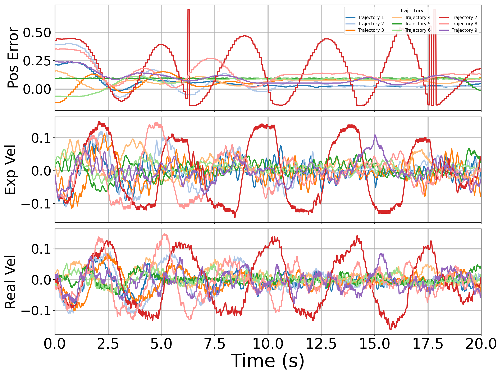
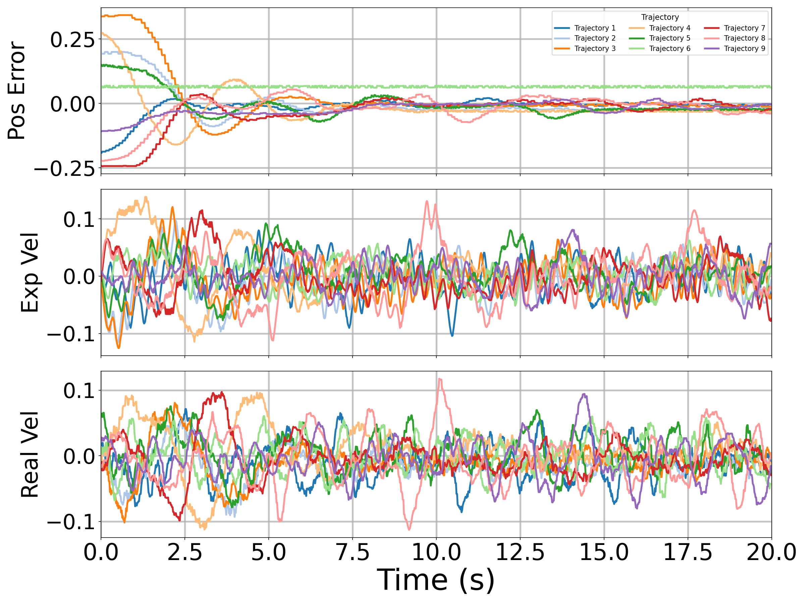
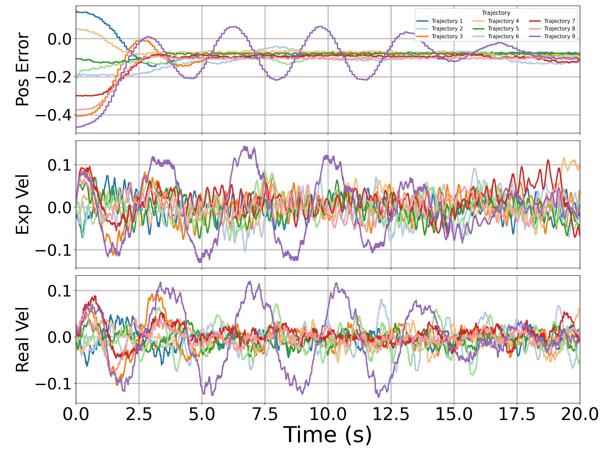
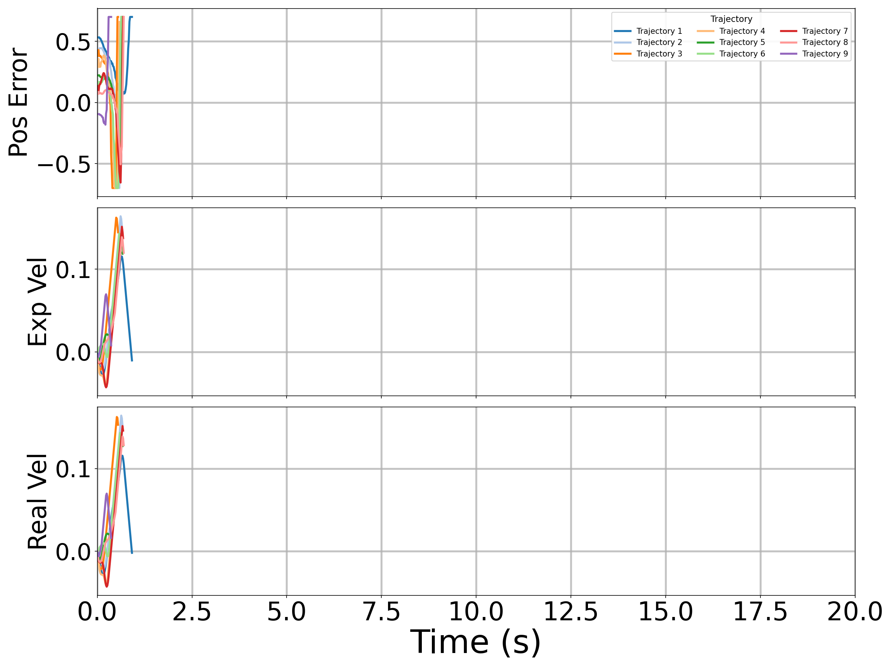
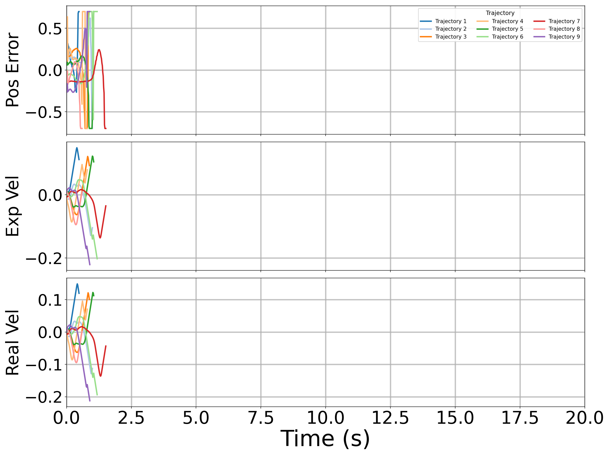
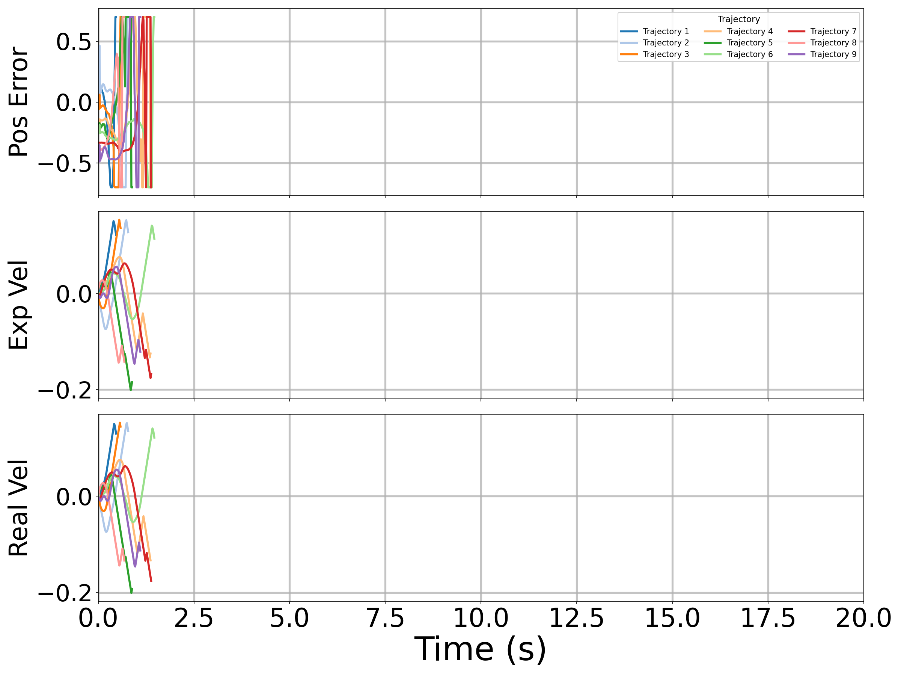
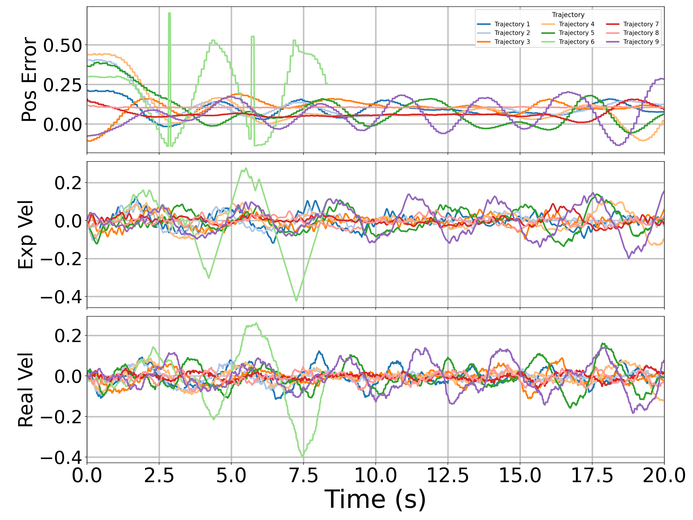
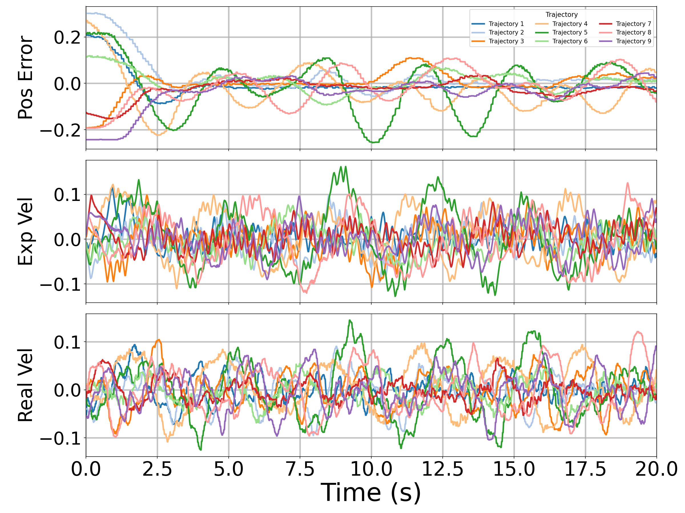
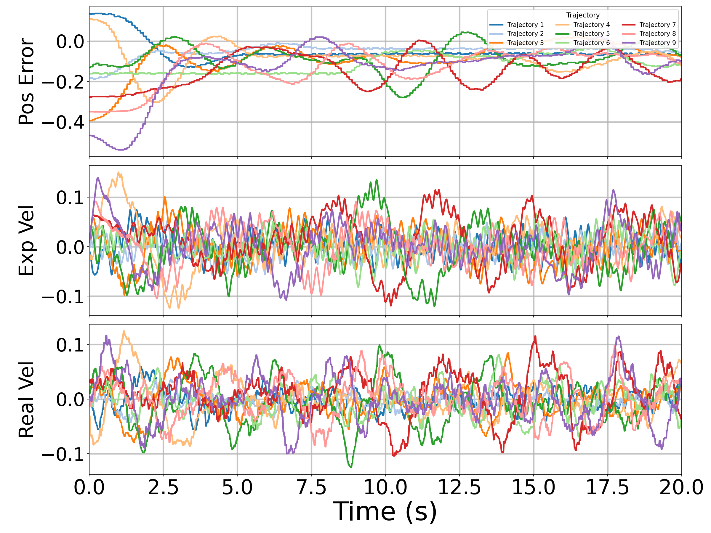

# Real-World Experiment Results

The real-world experiments directly transfer the simulation-designed or simulation-trained controllers without real-world fine-tuning. The experiments evaluate three target positions, `pg = 0.15`, `0.35`, and `0.55`, with target tolerance `0.03 m`, steady-state window `5 s`, 9 sampled initial ball positions per target, and 20 s episodes.

## Summary Table

| Goal | Controller | SR up | SE (mm) down | CONT (s) down | CLIT (s) down |
| --- | --- | ---: | ---: | ---: | ---: |
| 0.15 | Cascaded PID | 2/9 | 85.454 +/- 52.853 | 19.176 +/- 2.201 | 5.978 +/- 7.390 |
| 0.15 | NMPC, horizon=25 | 0/9 | 284.003 +/- 82.575 | 20.017 +/- 0.000 | 9.124 +/- 9.743 |
| 0.15 | RL | 1/9 | 113.055 +/- 64.221 | 19.987 +/- 0.084 | 7.696 +/- 8.007 |
| 0.35 | Cascaded PID | 6/9 | 21.944 +/- 16.780 | 13.641 +/- 7.008 | 4.024 +/- 5.668 |
| 0.35 | NMPC, horizon=25 | 0/9 | 232.710 +/- 47.256 | 20.017 +/- 0.000 | 2.644 +/- 6.150 |
| 0.35 | RL | 5/9 | 33.617 +/- 17.146 | 16.848 +/- 5.290 | 2.137 +/- 0.876 |
| 0.55 | Cascaded PID | 0/9 | 89.232 +/- 11.810 | 20.017 +/- 0.000 | 11.910 +/- 9.077 |
| 0.55 | NMPC, horizon=25 | 0/9 | 329.621 +/- 61.211 | 20.017 +/- 0.000 | 6.945 +/- 9.247 |
| 0.55 | RL | 0/9 | 71.738 +/- 27.767 | 20.017 +/- 0.000 | 5.042 +/- 5.519 |

## Trajectory Plots

| Controller | Goal 0.15 | Goal 0.35 | Goal 0.55 |
| --- | --- | --- | --- |
| Cascaded PID |  |  |  |
| NMPC, horizon=25 |  |  |  |
| RL |  |  |  |

## Video

Video record: [Real-world experiment video record](https://connectpolyu-my.sharepoint.com/:v:/g/personal/23133185r_connect_polyu_hk/IQDxLj0i3DODRaXlHvW_MMIAAd0OESveZyh1dvN-6Zt0Kbg?e=Q5eRsC&nav=eyJyZWZlcnJhbEluZm8iOnsicmVmZXJyYWxBcHAiOiJTdHJlYW1XZWJBcHAiLCJyZWZlcnJhbFZpZXciOiJTaGFyZURpYWxvZy1MaW5rIiwicmVmZXJyYWxBcHBQbGF0Zm9ybSI6IldlYiIsInJlZmVycmFsTW9kZSI6InZpZXcifX0%3D)
